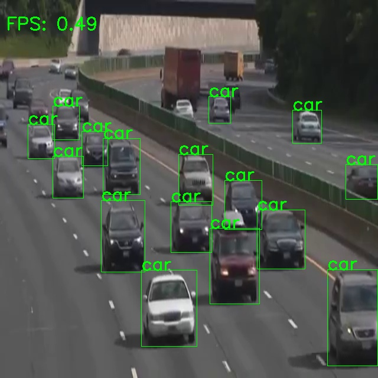

# Convert YOLOv9 Model to TensorFlow Lite

This repository provides scripts and instructions for converting a YOLO (You Only Look Once) model to TensorFlow Lite format. TensorFlow Lite is a lightweight solution for deploying machine learning models on mobile and edge devices, making it ideal for applications that require real-time object detection, such as mobile apps or embedded systems.

## Requirements

- Python 3.8.10
- TensorFlow 2.13.1
- Others

## Installation
- You need create the anaconda enviroment  
Step 1:
`conda create --name yolo9-tflite python=3.8.10`  
Step 2:
`conda activate yolo9-tflite`
- Continue you should install all the packages in requirements.txt 
`pip install -r requirements.txt`

## Convert
- You should run script end2end converting TFLite  
`bash convert_tflite.sh`

## Inference
- I have provided the config to run yolov9 <b>(config/yolov9.yaml)</b>

- You run to test the model  
`python inference.py`

## Output

## Contact

Email : anh1708001@gmail.com

